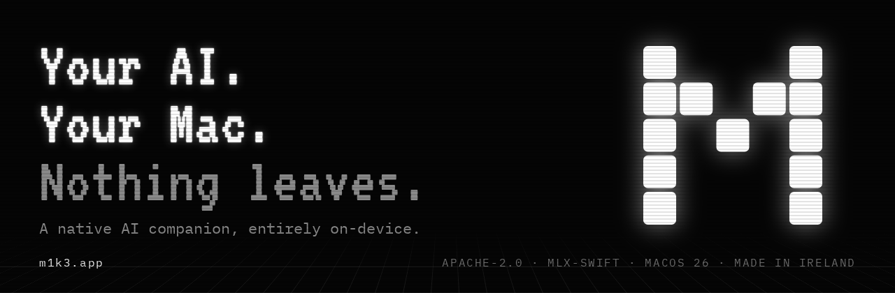

  

<h1 align="center">M1K3 — Own your AI</h1>

A native AI companion that runs <strong>entirely on your Apple-Silicon Mac</strong> —
local LLM inference, live voice, a personal knowledge graph with RAG, encrypted
call transcription, a local agent, and an MCP server. 
Edge AI you actually own: no cloud, no telemetry, no network cable it never asks for.

  <a href="https://github.com/Round-Tower/M1K3/releases/latest/download/M1K3.dmg"><strong>⬇ Download for macOS</strong></a>
  · <a href="https://m1k3.app">m1k3.app</a>
  · <a href="https://testflight.apple.com/join/Fxp2F5Je">TestFlight beta</a>

<em>Requires macOS 26 Tahoe · Apple Silicon · signed & notarized (Developer ID).</em>

  
  
  

  
  
  
  
  

---

## What's inside

- **On-device inference** — three brains: Apple Foundation Models for instant
  answers, Qwen 3 4B, and Gemma 4 12B via MLX. Chat with Mini from the first
  second while a bigger brain downloads.
- **Live voice** — sentence-streamed neural TTS + on-device speech-to-text, and
  a full-window voice mode with karaoke captions.
- **Knowledge + RAG** — drop in notes and PDFs; M1K3 remembers and cites, locally.
- **A memory that repairs itself** — a temporal memory graph of dated facts;
  when you correct something, the dream cycle supersedes the stale fact instead
  of silently losing either version, and keeps the history visible.
- **A face, and creatures** — the pixel face by default; an opt-in cast of
  low-poly 3D companions rendered on-device with RealityKit.
- **Call memory** — encrypted, on-device call transcription.
- **A local agent** — tools that *do* things, grounded in your own data, with
  markdown + syntax-highlighted code in chat.
- **MCP server** — 16 tools over local HTTP; give Claude and other agents a
  resident with a voice, a memory, and your knowledge.

Everything above runs without leaving the device. The only network use is the
one-time model download and an optional, explicitly-enabled web search.

| Surface | Where | Stack | Status |
|---|---|---|---|
| **macOS native** | [`macos/`](./macos) | Swift 6.2, SwiftUI, MLX-Swift | **The product** — on-device knowledge · RAG · agent · voice · calls. Build it: [`macos/README.md`](./macos/README.md). |
| **iOS + visionOS** | [`macos/M1K3iOSApp/`](./macos/M1K3iOSApp) | Swift 6.2, SwiftUI | Native SwiftUI shell on the **same** `macos/Sources/` package graph — chat · RAG · memories · docs. Ladder tops out at Lil on-device. See [`macos/docs/IOS_VISIONOS_PORT.md`](./macos/docs/IOS_VISIONOS_PORT.md). |
| **間 AI mobile** | [`app/`](./app) | Kotlin Multiplatform | Slow burn — the **Android** surface (KMP), pre-release. See [`app/README.md`](./app/README.md). |
| **The attic** | git history before `7545b4a4` | Python, THREE.js, Tauri | Where M1K3 grew up — the original CLI, avatar experiments, and ideas. Cleared from the tree 2026-08-13; see [The attic](#the-attic). |

## Get M1K3

- **[TestFlight beta](https://testflight.apple.com/join/Fxp2F5Je)** — the easiest way in.
- **[Download the DMG](https://github.com/Round-Tower/M1K3/releases/latest/download/M1K3.dmg)** — signed & notarized.
- **Build from source** — [`macos/README.md`](./macos/README.md): clone → `xcodegen generate` → ⌘R.

## MCP integration

The running Mac app serves MCP over HTTP at `http://127.0.0.1:4242/mcp` —
knowledge search, documents, voice, and `ask_m1k3` (ask the resident AI).
`.mcp.json` at the repo root wires Claude Code into it; setup for any client:
[`macos/docs/MCP_SETUP.md`](./macos/docs/MCP_SETUP.md).

### Tools

<!-- MCP-TOOLS:START -->
<!-- generated by mcp-inventory at 2026-07-05 20:39 — do not hand-edit; run: mcp-inventory --inject README.md --server m1k3 -->
<!-- hand-refreshed 2026-08-22 from M1K3MCPKit tool registrations: added list_jobs (landed 2026-08-19), count 15 → 16. Re-run mcp-inventory against the running app to regenerate. -->

_16 tools (generated live from the running server; hand-refreshed 2026-08-22)._

| Tool | Required args | What it does |
|------|---------------|--------------|
| `ask_m1k3` | — | Ask M1K3's local brain a question |
| `forget_memory` | query | Permanently forget a fact M1K3 remembers — the consent primitive, the counterpart to remember |
| `get_answer` | job_id | Fetch the result of an ask_m1k3 call that returned a job id because it was taking a while |
| `get_document` | id | Fetch the text of one indexed item by its id (from list_documents) |
| `get_status` | — | M1K3's overall status: active brain tier, TTS provider, voice tier, and the busy flags — whether M1K3 is speaking, in a conversation, using its mic, or already answering an ask_m1k3 call |
| `list_documents` | — | List the items M1K3 has indexed, with their ids, kinds, and titles. |
| `list_jobs` | — | List recent ask_m1k3 jobs — id, state (running/done/error), and age in seconds. Use this to recover a job id you lost; redeem a done job via get_answer |
| `listen` | — | Listen on M1K3's microphone and return the transcript once the speaker pauses (or the timeout passes) |
| `memory_stats` | — | How many atomic facts M1K3 currently remembers (the live, non-superseded count) |
| `open_link` | url | Open a web link in M1K3's review panel on the user's screen, beside the conversation, so they can see the page |
| `recall_memory` | query | Recall atomic facts M1K3 remembers about the user — the temporal memory GRAPH, separate from the document corpus search_knowledge reads |
| `related_memory` | query | Recall the single best matching fact for the query, then walk M1K3's memory GRAPH one step out to its neighbours (linked or superseded facts) |
| `remember` | title, text | Store text in M1K3's memory — it becomes part of what M1K3 knows, searchable in every future conversation (the same store search_knowledge reads) |
| `search_knowledge` | query | Search M1K3's stored knowledge (documents, calls, notes; hybrid retrieval when available) |
| `speak` | text | Speak text aloud through M1K3's voice (and animate the avatar) |
| `stop_speaking` | — | Stop any in-progress speech immediately. |

<!-- MCP-TOOLS:END -->

> The table above is generated live from the running app — never hand-edit it.
> Refresh with `mcp-inventory --inject README.md --server m1k3` (needs the M1K3 app running).

## The attic

M1K3 didn't start as a Mac app. It started in August 2025 as a Python CLI with
a synthesized voice, grew a THREE.js avatar, a PWA, a Tauri popover, a RAG
engine, and an MCP server — and then everything it learned was rebuilt native.
That history is signed and permanent in this repo's git history — a project
about provenance should keep its own. The `attic/` tree was cleared from the
working copy on 2026-08-13; to walk through it, check out any commit before
`7545b4a4` (or resurrect it with `git checkout 7545b4a4 -- attic`).

## Contributing

Start with [`CONTRIBUTING.md`](./CONTRIBUTING.md). Architecture and current
state: [`CLAUDE.md`](./CLAUDE.md). Security reports: [`SECURITY.md`](./SECURITY.md).

## Privacy

Inference, retrieval, and voice run on-device. No telemetry; conversations stay
on your machine. Network is only used to download models on first run.

## License

**[Apache License 2.0](./LICENSE).** M1K3 is free and open source — use it, fork
it, build on it, commercially or otherwise. Attribution and third-party notices
are in [`NOTICE`](./NOTICE).

Contributions are accepted under the same Apache-2.0 terms (per
section 5 of the License). M1K3 is built in the open with
[MurphySig](https://murphysig.dev) provenance — the git history is signed,
human-and-AI collaboration on the record.
